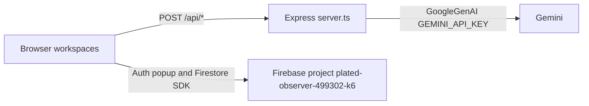

# About this checkout

This is a Vite and Express workspace that Google AI Studio exported as a Node applet. The sidebar brand is The Fleet. `package.json` still says `react-example`. `index.html` still says `My Google AI Studio App`. `metadata.json` still says `Agent Workspace`.

Gemini never runs in the browser. The browser posts to same-origin `/api/*`. `server.ts` calls `@google/genai` with `process.env.GEMINI_API_KEY`. Journal, Archive, and Prompts talk to Firebase Auth and Firestore from the client. Chat, images, search, and maps live only in React state.

Leave AI Studio and you keep a small hybrid app. The app assumes Studio injects secrets, hosts Express on port 3000, and may have bound Firestore to a named database this checkout does not select.

## Key concepts

`AppMode` in `src/types.ts` is the sidebar. There are eight modes. One workspace mounts at a time.

`GoogleGenAI` in `server.ts` is the only Gemini client. The server constructs it once at boot.

`ModelAlias` is `'gemini-3.5-flash' | 'gemini-3.6-flash' | 'gemini-3.7-flash'`. The chat UI uses that union. Image, search, and maps models sit as string literals on the server.

`Role` is `'user' | 'model'`. Those are Gemini names, not OpenAI's `assistant`.

`firebase-applet-config.json` is the committed web config. `src/lib/firebase.ts` passes the whole JSON to `initializeApp`. Extra keys such as `firestoreDatabaseId` and `oAuthClientId` are not standard `FirebaseOptions`.

`MAJOR_CAPABILITY_SERVER_SIDE_GEMINI_API` in `metadata.json` is Studio metadata. The app never imports that file.

## How it works

`tsx server.ts` starts Express on `0.0.0.0:3000`. If `NODE_ENV` is not `production`, the process mounts Vite SPA middleware. If it is `production`, the process serves `dist`. `npm start` is `node dist/server.cjs` and does not set `NODE_ENV`. The browser loads `src/main.tsx`, then `App`, then `Sidebar` plus one workspace.

Chat, Prompts, image gen, image edit, Nexus, and Atlas post to `/api/chat`, `/api/image/generate`, `/api/image/edit`, `/api/search`, and `/api/maps`. Those routes have no auth middleware. Prompts can generate while you are logged out. Journal, Archive, and Prompts persist only after Google sign-in. They query `journals`, `sessions`, and `prompts` with `userId == uid`.

`/api/chat` builds `history` and calls `ai.chats.create`, then ignores both and uses `ai.models.generateContent`. That unused path is in `server.ts` at lines 42 to 62.

### Modules installed

The lockfile is `bun.lock`. The scripts still call `tsx`, `vite`, `esbuild`, `node`, and `tsc`. There is no `package-lock.json`.

These packages are used at runtime or in scripts. Versions are the declared ranges in `package.json`. Confirm resolved versions with `grep` in `bun.lock`.

| Package | Declared | Role |
|---|---|---|
| `@google/genai` | `^2.4.0` | Gemini in `server.ts` and the two scratch scripts |
| `express` | `^4.21.2` | API and static or Vite host |
| `multer` | `^2.2.0` | `/api/image/edit` |
| `firebase` | `^12.16.0` | Auth and Firestore only |
| `react-firebase-hooks` | `^5.1.1` | `useAuthState` |
| `react` and `react-dom` | `^19.0.1` | UI |
| `vite` | `^6.2.3` | Dev middleware and `vite build`. Also listed in `devDependencies` |
| `@vitejs/plugin-react` | `^5.0.4` | Vite React plugin |
| `@tailwindcss/vite` and `tailwindcss` | `^4.1.14` | Tailwind v4 via `@import "tailwindcss"` |
| `react-markdown` | `^10.1.0` | Chat, Nexus, and Atlas. Archive imports it and does not use it |
| `lucide-react`, `clsx`, `uuid`, `date-fns` | as declared | Icons, class names, chat ids, dates |
| `tsx`, `esbuild`, `typescript` | dev | `dev`, `build`, `lint` |
| `@types/*` | dev | Types |

These are unused. An import grep against `src/` and `server.ts` finds no references.

- `dotenv` is in `package.json` and never imported
- `markdown-to-jsx` duplicates `react-markdown`
- `motion` has no import
- `tailwind-merge` has no import
- `autoprefixer` has no PostCSS config

There is no `@google/generative-ai` package. There is no `@google-cloud/*` package. Search and Maps are Gemini tool objects, not extra npm packages. `vite` sits in `dependencies` because `server.ts` imports `createViteServer` in non-production.

### Where it is hardcoded to Google

SDK and env:

- `server.ts` imports `GoogleGenAI` and reads `process.env.GEMINI_API_KEY`
- `User-Agent` is the literal `aistudio-build`
- `test-img-gen.ts` and `test-instruction.ts` use the same key, without that User-Agent
- `.env.example` documents Studio Secrets injection for `GEMINI_API_KEY` and a Cloud Run `APP_URL`
- `APP_URL` appears only in `.env.example`. Nothing reads it

Models:

- Chat default, search, and maps use `gemini-3.5-flash`
- The chat dropdown also lists `gemini-3.6-flash` and `gemini-3.7-flash`
- Image gen, image edit, UI labels, and the scratch scripts use `gemini-3.1-flash-image`
- Prompts hardcodes `model: 'gemini-3.5-flash'`

Tools in `server.ts`:

- `{ googleSearch: {} }` on `/api/search`
- `{ googleMaps: {} }` on `/api/maps`

Firebase:

- `src/lib/firebase.ts` imports `firebase-applet-config.json`, `GoogleAuthProvider`, and `signInWithPopup`
- The project id is `plated-observer-499302-k6`. The auth domain is `*.firebaseapp.com`. The storage bucket is `*.firebasestorage.app`
- The named database `ai-studio-agentworkspace-5398cfc1-21a7-4a65-8b21-30c4d660790a` is in the JSON and is never passed to `getFirestore(app)`
- `oAuthClientId` is in the JSON and is never passed to the provider
- Sidebar copy is **Sign in with Google**

Studio leftovers:

- `metadata.json` capability `MAJOR_CAPABILITY_SERVER_SIDE_GEMINI_API`
- `vite.config.ts` `DISABLE_HMR` comments and watch disable
- `firebase-blueprint.json` and `firestore.rules` are not imported
- `assets/.aistudio/.gitignore` is `*`
- `index.html` title `My Google AI Studio App`

First-party source has no Gemini REST URL. The host is whatever `@google/genai` defaults to for an API key. This checkout does not include `node_modules`, so the exact hostname is not visible here.

### Red flags

High, after you leave Studio:

1. `/api/chat`, `/api/image/generate`, `/api/image/edit`, `/api/search`, and `/api/maps` are unauthenticated proxies. Anyone who can reach the host can spend the Gemini key. The client also sends `model` and `systemInstruction` on chat. A public Cloud Run or VPS will expose those routes. Studio preview may have gated the URL. That gate is not in this repo.
2. `dotenv` never loads. A local `.env` copied from `.env.example` does nothing unless the process supervisor injects `GEMINI_API_KEY`. A missing key means 500s, not a boot failure.
3. `PORT` is `3000`. Listen is `0.0.0.0`. Platforms that set `process.env.PORT` to 8080 will health-check the wrong port.
4. `getFirestore(app)` uses `(default)`. Studio's named database id is unused. Journals you already wrote may be on the other database. Deploying `firestore.rules` with the CLI, with no `firebase.json` in the tree, also targets `(default)`.
5. Journal, Archive, and Prompts use `where(userId)` plus `orderBy`. That needs composite indexes. There is no `firestore.indexes.json`. `onSnapshot` has no error callback. On a fresh `(default)` database, `failed-precondition` becomes an infinite spinner or an empty list.
6. The JSON body limit is `50mb`. Multer memory storage has no file-size cap. An open `/api/image/edit` can pin RAM.
7. Preview model ids, Search and Maps tools, and `aistudio-build` may return 400 or 403 on a normal Gemini developer key. This checkout did not call Gemini.
8. There is no `firebase.json`, `.firebaserc`, or `storage.rules`. You cannot `firebase deploy` this tree as written.
9. `npm start` does not set `NODE_ENV=production`. Anything other than `production` calls `createViteServer`. That path needs `vite.config.ts`, `src/`, and `vite` in `node_modules`. Studio's container may have set the variable. This repo does not.
10. `esbuild` writes `dist/server.cjs` into the same directory that `express.static` serves. A `GET /server.cjs` can download the server bundle. The Gemini key is not in that file. The route logic is.

Medium:

- The Firebase web `apiKey` in `firebase-applet-config.json` is public by design and ships in the client bundle. It is not the Gemini secret. An unrestricted key plus an empty `recaptchaSiteKey` still lets anyone create Auth users and write within rules.
- A new origin needs Firebase authorized domains, or Google sign-in fails with `auth/unauthorized-domain`.
- Chat, images, Nexus, and Atlas do not persist. A refresh drops them. `storageBucket` is unused.
- 500 responses return `error.message`. Quota and model names leak to any caller.
- Fetches use relative `/api/...` paths. There is no `cors` package. Split Hosting and API will fail in the browser. `vite` alone returns 404 on every AI route.
- `test-img-gen.ts` and `test-instruction.ts` hit live Gemini if the key is set. They are not in npm scripts. `tsc --noEmit` still typechecks them.
- Atlas filters `chunk.web` after a `googleMaps` tool. Location cards can be empty while the text works.
- Chat appends API failures as `role: 'model'` messages. The next turn sends those error strings back as history.

Low:

- Grounding `href={chunk.web.uri}` is unsanitized. There is no CSP in `index.html`.
- The Journal placeholder says markdown. The editor is a textarea.
- `.gitignore` already ignores `.env*`. That part is fine.

The next engineer inherits two backends glued by a Studio template. Express owns spend. Firebase owns identity and three collections. Nothing in this repo proves that those two share one security story.

## Where things live

| Path | What it is |
|---|---|
| `server.ts` | Express, Gemini, Vite or `dist` |
| `src/App.tsx` | Mode switch |
| `src/components/*Workspace.tsx` | One mode each |
| `src/components/Sidebar.tsx` | Nav and Google auth |
| `src/lib/firebase.ts` | Auth and Firestore init |
| `src/types.ts` | `Role`, `ModelAlias`, `AppMode` |
| `firebase-applet-config.json` | Committed Firebase web config |
| `firebase-blueprint.json` | Studio provisioning. Not imported |
| `firestore.rules` | Owner rules for three collections |
| `metadata.json` | Studio applet descriptor |
| `.env.example` | Studio secret comments |
| `test-img-gen.ts`, `test-instruction.ts` | Scratch Gemini scripts |

## Gotchas

`firestoreDatabaseId` looking configured is the easy miss. The runtime call is `getFirestore(app)` with one argument.

`.env.example` comments claim that `APP_URL` is used for OAuth and API bases. Auth is a Firebase popup. API calls are relative `/api/...` paths.

`clean` deletes `server.js`. Build writes `dist/server.cjs`.

The `@/` alias in `tsconfig.json` and `vite.config.ts` has zero imports.

`vite` is listed in both `dependencies` and `devDependencies`. The `server.ts` import makes the `dependencies` entry load-bearing. Drop the `devDependencies` copy, not the other one.

Archive `handleSave` writes `summary` and `notes` and does not bump `date`. The list order does not change on edit. Journal does bump `updatedAt`.

This checkout was not run, `node_modules` was not installed, and live Firebase or Gemini was not called. These stay unknown:

- Whether Studio's hosted runtime remapped Firestore to the named database
- Whether `(default)` already has these rules, open test rules, or indexes
- Whether `gemini-3.6-flash`, `gemini-3.7-flash`, and `gemini-3.1-flash-image` exist on a key you create outside Studio
- Whether `googleMaps` grounding needs a separate Maps key

A useful first cut is to require a Firebase ID token on `/api/*`, load `GEMINI_API_KEY` on purpose, honor `PORT`, set `NODE_ENV=production` on `start`, keep `server.cjs` out of the static root, and point `getFirestore` at the database that actually has your data.
